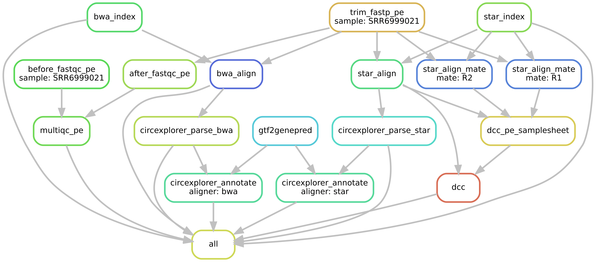

# CircRNA pipeline

a snakemake pipeline to process RNA-seq data, which integrates [CIRI2](https://pubmed.ncbi.nlm.nih.gov/28334140), [DCC](https://github.com/dieterich-lab/DCC), [CIRCexplorer2](https://github.com/YangLab/CIRCexplorer2) to detect circular RNAs.



## Getting Started

### Prerequisites

- [conda](https://docs.conda.io/en/latest/miniconda.html), download packages from [official website](https://docs.conda.io/en/latest/miniconda.html#linux-installers)

```bash
bash Miniconda3-latest-Linux-x86_64.sh
```

- [snakemake](https://github.com/snakemake/snakemake)

```bash
conda create -n circpipe python=3.7
source activate circpipe
conda install -c bioconda snakemake
```

- [DCC](https://github.com/dieterich-lab/DCC)

```bash
conda create -n py2 python=2.7
source activate py2
wget https://github.com/dieterich-lab/DCC/archive/v0.4.8.tar.gz
tar zxvf v0.4.8.tar.gz
cd DCC-0.4.8
python setup.py install
```

- [CIRI2](https://sourceforge.net/projects/ciri/files/CIRI2/)

```bash
sudo apt-get install perl
wget https://jaist.dl.sourceforge.net/project/ciri/CIRI2/CIRI_v2.0.6.zip
unzip CIRI_v2.0.6.zip
# export CIRI.pl to path
```

- BWA, STAR, FastQC, multiQC, circexplorer2, ucsc-gtftogenepred, fastp (*use conda environment*)

## Usage

`config.yaml` defines the configuration information of the circRNA pipeline. `units.tsv` gives the information of sequencing reads. 

```bash
source activate circpipe
snakemake --use-conda -j 20
## generate dag 
snakemake --dag | dot -Tsvg > dag.svg
```

## Results Tree

```bash
├── 01_data
│   ├── annotation
│   ├── genome
│   ├── index
│   └── raw
├── 02_qc
│   ├── after_trimmed
│   ├── before_trimmed
│   └── multiqc_report_data
├── 03_trim
├── 04_align
│   ├── bwa
│   └── star
├── 05_output
│   ├── circexplorer
│   ├── ciri
└── └── dcc
```

## Authors

* **feifei9606**

## License

This project is licensed under the MIT License

## Contributing

- report bugs or features improvement, [Issues](https://github.com/feifei9606/snakemake/issues)
- [Pull Request](https://github.com/feifei9606/snakemake/pulls)

## Acknowledgments

* [andremrsantos/circrna_smk](https://github.com/andremrsantos/circrna_smk)
* [iprada/circrna_snakemake](https://github.com/iprada/circrna_snakemake)
* [snakemake-workflows/rna-seq-star-deseq2](https://github.com/iprada/circrna_snakemake)
* [Reproducible research](https://reproducibility.sschmeier.com/)
